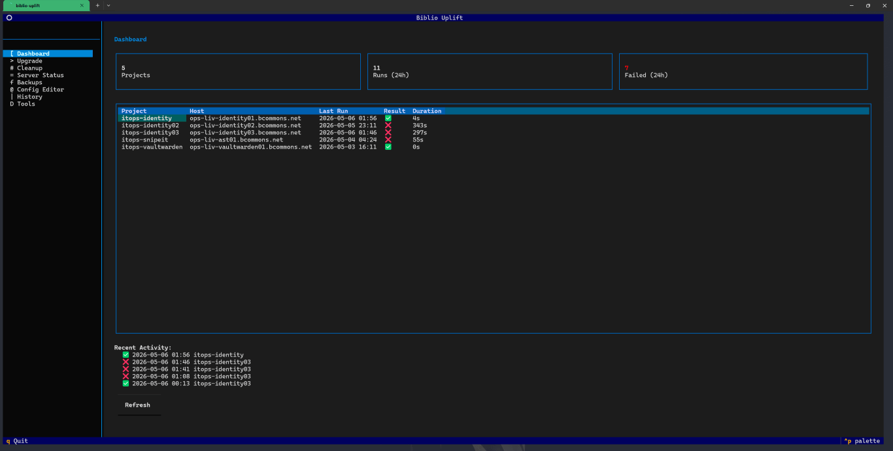
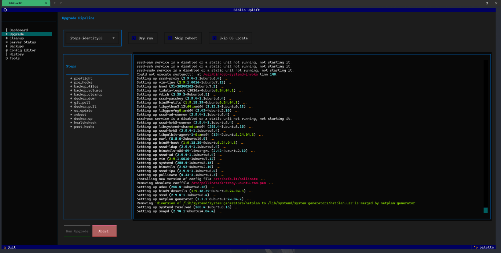
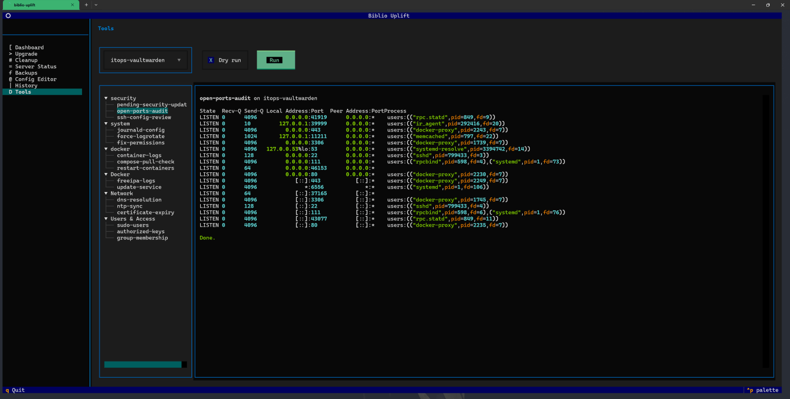

# biblio-uplift

TUI and CLI tool for upgrading Docker Compose-based services on remote servers via SSH.

## Install

```bash
pip install .
```

## Quick Start

```bash
# Launch the interactive TUI
biblio-uplift

# Run an upgrade from the CLI
biblio-uplift run itops-vaultwarden

# Run non-interactively (for cron/automation)
biblio-uplift run itops-vaultwarden --non-interactive

# Dry run (simulate without executing)
biblio-uplift run itops-vaultwarden --dry-run

# Run cleanup (prune docker resources, old logs)
biblio-uplift cleanup itops-vaultwarden

# Check server status
biblio-uplift status itops-vaultwarden

# Restore from a backup
biblio-uplift restore itops-vaultwarden
biblio-uplift restore itops-vaultwarden --backup 20260501-030000

# Resume an upgrade after reboot (if session was lost)
biblio-uplift resume

# Run upgrades on all projects sequentially
biblio-uplift run-all --non-interactive

# List available backups
biblio-uplift backup list itops-vaultwarden

# Update a single service (pull repo + recreate)
biblio-uplift service-update my-project haproxy

# Check/upgrade Docker Compose install method
biblio-uplift tool run itops-vaultwarden compose-version

# List available tools
biblio-uplift tool list

# Run a tool against a project
biblio-uplift tool run itops-vaultwarden pending-security-updates

# Manage configs
biblio-uplift config edit itops-vaultwarden
biblio-uplift config validate itops-vaultwarden
biblio-uplift config create my-project --host myhost.example.com --project-dir /opt/docker/my-project
biblio-uplift config delete my-project

# View history
biblio-uplift history --last 10

# Scaffold config/data directories (first-time setup)
biblio-uplift init

# View current settings
biblio-uplift settings show

# Update a setting
biblio-uplift settings set KEY VALUE

# Sync config repo
biblio-uplift sync

# Show 30-day upgrade analytics
biblio-uplift analytics
```

## Screenshots

### Dashboard



### Upgrade Pipeline



### Tools



## Configuration

Project configs live in `configs/` as YAML files. Each config defines a remote server and its Docker Compose project.

```bash
# List configured projects
biblio-uplift config list

# Show a project's config
biblio-uplift config show itops-vaultwarden
```

### Config Fields

| Field | Default | Description |
|-------|---------|-------------|
| `name` | required | Project identifier |
| `ssh_host` | required | Remote server hostname |
| `ssh_user` | `ansible` | SSH username |
| `ssh_key` | `~/.ssh/id_ed25519` | Path to SSH private key (must not have a passphrase, or use ssh-agent) |
| `sudo` | `true` | Prefix remote commands with sudo |
| `project_dir` | required | Path to the Docker Compose project on the remote server |
| `compose_files` | `["docker-compose.yml"]` | Compose file(s) to use |
| `compose_profile` | `null` | Compose profile. Set to `hostname` to use `$(hostname -s)` on the remote |
| `compose_command` | `docker compose` | Compose binary |
| `backup_dir` | `/var/backups/itops` | Where to store backups on the remote server (local disk, not NFS) |
| `backup_retention` | `5` | Number of backups to keep |
| `volumes` | `[]` | Docker volume names to back up |
| `extra_backup_paths` | `[]` | Additional paths to include in file backup |
| `healthcheck_urls` | `[]` | HTTP(S) URLs to check after startup |
| `healthcheck_timeout` | `120` | Seconds to wait for containers to become healthy |
| `skip_os_update` | `false` | Skip OS package updates by default |
| `skip_reboot` | `false` | Skip reboot by default |
| `ssh_port` | `22` | SSH port |
| `git_branch` | `main` | Git branch to pull |
| `maintenance_window` | `null` | Allowed time window for runs (e.g. `"Sun 02:00-06:00"`) |
| `on_failure_cmd` | `null` | Shell command to run on failure (e.g. Slack webhook) |
| `on_success_cmd` | `null` | Shell command to run on success |
| `reboot_timeout` | `300` | Seconds to wait for SSH after reboot |
| `apt_timeout` | `600` | Seconds to wait for apt operations |
| `pre_upgrade_hooks` | `[]` | Shell commands to run before upgrade (executed as root via sudo) |
| `post_upgrade_hooks` | `[]` | Shell commands to run after upgrade |

### Hooks

Pre/post upgrade hooks are arbitrary shell commands executed on the remote server. They run as root (via sudo). Use them for things like:

```yaml
pre_upgrade_hooks:
  - "systemctl stop ci-runner"
  - "/opt/scripts/notify-slack.sh 'Starting upgrade'"
post_upgrade_hooks:
  - "systemctl start ci-runner"
  - "/opt/scripts/notify-slack.sh 'Upgrade complete'"
```

## Settings

App-level settings are stored in `~/.config/biblio-uplift/settings.json`. Configure via the TUI Settings panel or CLI:

```bash
biblio-uplift settings show
biblio-uplift settings set config_repo_url git@github.com:org/configs.git
biblio-uplift settings set theme dark
```

Settings include config repo sync (automatically pull project configs from a git repo on launch), editor preference, analytics retention, and theme. See [docs/SETTINGS.md](docs/SETTINGS.md) for details.

## Upgrade Pipeline

The upgrade runs these steps in order:

1. **Preflight** — SSH connectivity, disk space check, backup size estimation
1. **Pre-hooks** — Custom pre-upgrade commands
1. **Backup files** — Tar project dir + extra paths
1. **Backup volumes** — Export Docker volumes via alpine container
1. **Backup cleanup** — Remove old backups beyond retention count
1. **Docker down** — `docker compose down`
1. **Git pull** — Pull latest from remote
1. **Docker pull** — Pull latest images
1. **OS update** — `apt-get update && upgrade && autoremove --purge`
1. **Reboot** — Reboot and wait for SSH to come back
1. **Docker up** — `docker compose up -d`
1. **Health check** — Wait for containers healthy + HTTP checks
1. **Post-hooks** — Custom post-upgrade commands

On failure, completed steps are rolled back in reverse order (docker down → docker up, git pull → git checkout previous commit).

## Cleanup Pipeline

1. **Preflight** — SSH connectivity check
1. **Docker cleanup** — Prune stopped containers, dangling images, unused volumes, build cache
1. **Log cleanup** — Truncate configured log files, vacuum journald

Set `aggressive_prune: true` in the cleanup config to remove *all* unused images (not just dangling) during cleanup.

## TUI

Running `biblio-uplift` with no command launches the interactive terminal UI. It has 10 panels:

- **Dashboard** — Overview of all projects and their last run status, 30-day analytics
- **Upgrade** — Run upgrades interactively with live step progress
- **Cleanup** — Run cleanup pipelines with live output
- **Server Status** — View remote server health (disk, memory, uptime, containers)
- **Backups** — Browse and restore backups
- **Config Editor** — View and edit project configurations
- **History** — Browse past upgrade runs with filtering
- **Tools** — Security audits, log rotation, container management tools
- **Settings** — App settings, config repo sync, editor detection, theme
- **About** — Version info and links

## CLI Flags

```
biblio-uplift [--debug] [--version] COMMAND

Global:
  --debug              Write verbose logs to logs/debug.log
  --version            Show version and exit

run PROJECT:
  --non-interactive    Skip confirmation prompts
  --skip-reboot        Skip the reboot step
  --skip-os-update     Skip OS package updates
  --skip-backup        Skip all backup steps
  --skip-git           Skip git pull
  --dry-run            Simulate without executing
  --no-hooks           Skip pre/post hooks
  --on-failure TEXT    Shell command to run on failure (overrides config)
  --start-from TEXT    Skip steps before this one (e.g. docker_pull)

cleanup PROJECT:
  --non-interactive    Skip confirmation prompts
  --dry-run            Show what would be done

restore PROJECT:
  --backup TEXT        Backup timestamp to restore (defaults to latest)
  --non-interactive    Skip confirmation prompts

resume:
  Resume an upgrade after reboot if the controlling session was lost.
  No options.

status PROJECT:
  Show current status of a project's remote server.
  No options.

backup list PROJECT:
  List available backups for a project.
  No options.

service-update PROJECT SERVICE:
  Pull repo and recreate a single service.
  --non-interactive    Skip confirmation prompts

tool list:
  List available tools by category.

tool run PROJECT TOOL_NAME:
  --dry-run            Preview what would happen
  --non-interactive    Skip confirmation prompts

run-all:
  --non-interactive    Skip confirmation prompts
  --skip-reboot        Skip the reboot step
  --skip-os-update     Skip OS package updates
  --dry-run            Simulate without executing
  --projects TEXT      Comma-separated project names (defaults to all)

config:
  config list          List all project configurations
  config show PROJECT  Show configuration details for a project
  config create NAME   Create a new project configuration
    --host TEXT          SSH hostname (required)
    --project-dir TEXT   Remote project directory (required)
    --ssh-user TEXT      SSH username
    --ssh-key TEXT       Path to SSH key
  config edit PROJECT  Open config in $EDITOR
  config validate PROJECT
                       Validate config by testing SSH, Docker, and paths
  config delete PROJECT
                       Delete a project configuration
    --non-interactive    Skip confirmation prompts

history:
  --project TEXT       Filter by project
  --last INTEGER       Show last N entries (default: 20)

init:
  Scaffold config and data directories for first-time setup.
  No options.

settings show:
  Display all current settings.

settings set KEY VALUE:
  Update a single setting.

sync:
  Sync config repo (clone or pull).
  No options.

analytics:
  Show 30-day upgrade analytics (success rate, avg duration, slowest steps).
  No options.
```

## Audit History

Every run is logged to a SQLite database at `~/.local/share/biblio-uplift/history.db` with tables for runs, step timings, and tool executions. View with:

```bash
biblio-uplift history
biblio-uplift history --project my-project --last 5
biblio-uplift analytics
```

## Concurrent Run Protection

A file lock (`/tmp/biblio-uplift-<project>.lock`) prevents multiple upgrades of the same project from running simultaneously.

## Exit Codes

| Code | Meaning |
|------|---------|
| 0 | Success |
| 1 | Pipeline failed or error |

## Cron / Unattended Use

```bash
# Weekly upgrade of vaultwarden, Sundays at 3am
0 3 * * 0 cd /path/to/biblio-uplift && biblio-uplift run itops-vaultwarden --non-interactive --on-failure "curl -X POST https://hooks.slack.com/services/YOUR/WEBHOOK -d '{\"text\": \"Vaultwarden upgrade failed\"}' " >> logs/cron.log 2>&1
```

For unattended runs:

- Always use `--non-interactive` to skip confirmation prompts
- Set `on_failure_cmd` in config or use `--on-failure` for failure alerts
- Set `maintenance_window` in config to prevent accidental runs outside hours
- Monitor exit codes and `logs/history.jsonl` for audit trail

## Development

```bash
pipx install --force .
biblio-uplift --debug run itops-vaultwarden --dry-run
```

Set `ITOPS_UPGRADE_DIR` to override the project root directory detection.
